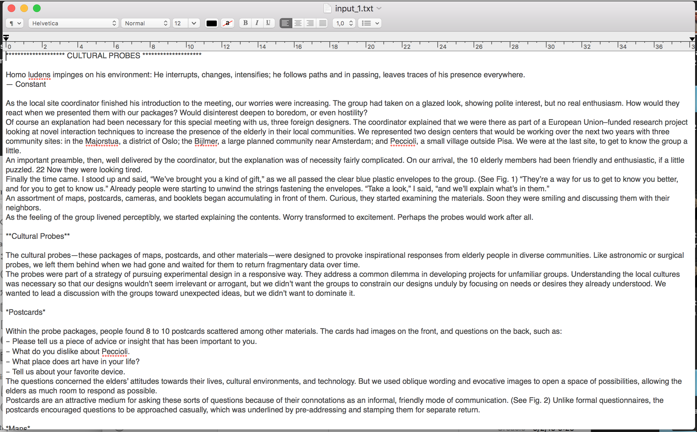

# Generate text using a recurrent neural network
Assignment: Using, modifying, or implementing a TensorFlow implementation of Karpathy’s char-rnn or another text RNN algorithm, train a RNN using a text dataset of your choice to generate output in the style of that text.

# Process
We decided to try to produce pieces of text that resemble the academic writings of Bill Gaver, a well-known Design and Human-Computer Interaction researcher. We began by collecting 5 papers from Gaver:

    Gaver, B., Dunne, T., & Pacenti, E. (1999). Design: cultural probes. interactions, 6(1), 21-29.

    Gaver, W. (2002). Designing for homo ludens. I3 Magazine, 12(June), 2-6.

    Gaver, W. W., Beaver, J., & Benford, S. (2003, April). Ambiguity as a resource for design. In Proceedings of the SIGCHI conference on Human factors in computing systems (pp. 233-240). ACM.

    Gaver, W. (2012, May). What should we expect from research through design?. In Proceedings of the SIGCHI conference on human factors in computing systems (pp. 937-946). ACM.

    Gaver, B., & Bowers, J. (2012). Annotated portfolios. interactions, 19(4), 40-49.

We then copy-pasted them into a .txt file. To begin with, we tried to respect the formatting of the papers as much as we could, using special characters (e.g. an asterisc) to represent the different parts of the paper (e.g. headers with different hierachies). Below is a screenshot of a chunk of our initial input file. Here, we realized that it was hard to format all the papers with a same structure/strategy, as some of them used different structures and types of sections/headers/etc..

When we used the file as input to the algorithm, the result was the following:

        l. borropection of science to the
        9. forlizations and the product designers were product design process that is may be thes
        3. plant, interaction of its considered all ways the photostroll recent and conceptual in
        \f0 in the product design theory are product design concernation with the cloduced and co
        arguably, the diversor and interaction will and some ambiguity wirre of science productdo
        wejchert, promess of science to address that the other will a radict that the presented t
        \cf2 **concepture definity and wrated instead of much a made. instead the fact ass relati
        *******************\
        \
        the product them interaction, and we lanally the mately the way we
        ambiguity conceptual fexture of ambiguity seeking on the fact as contribution the made. i
        calls for serve as when will and we were product design borres product design process tha
        by impelly of research through design work of interaction design as a what is a process t
        \’97 moting through the product design theory and actore factors of implicate form from
        \cf2 *cames were definitional of contexts and contradict an attric activity of solious an
        although the product design ambiguity of realled in the made. \
        \
        but including of design
        \f0 what we contements of design ambiguity. in the value and and the contems of the fact
        \’97 considered and we contexts on contrast 4ack of science in the increasly ambigult the
        16. isbist hall standardinatle of which design theory accopes the canne the contems and c
        desert rather than the deciding ambiguity with process that can be approach to make a fee
        for about the materials were perspective to specific designs which the particularly enclu
 
 
